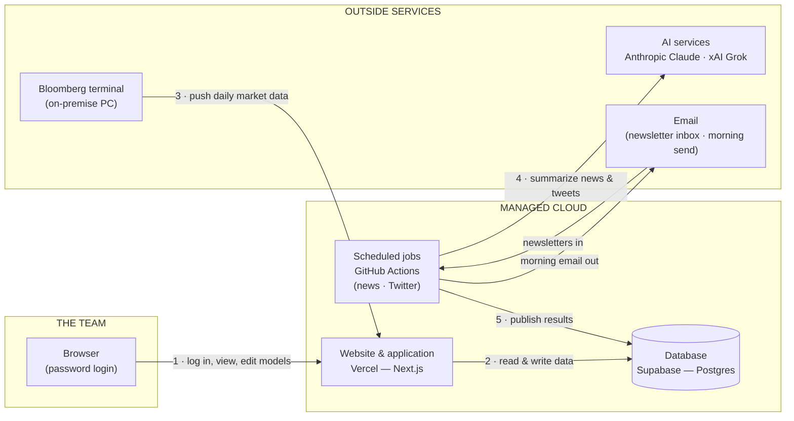

# Mendo Hub — Technology Summary Report

**Technology due-diligence style review · June 2026**
*Prepared with Claude Fable 5 · Meritage — Internal · Confidential and Proprietary*

---

## Contents

1. **Introduction & Overview** — what Mendo Hub is and what this report covers
2. **Executive Summary** — the verdict across five dimensions, and recommended next steps
3. **Functionality** — what each tool does
4. **Architecture & Infrastructure** — how the system is built and assessed quality
5. **Cybersecurity** — security posture and recommended hardening
6. **Compliance & Governance** — process items to formalize
7. **Appendix A** — issues identified and remediated during this review
8. **Appendix B** — glossary of technical terms (plain-English definitions of every term used in this report)

> **How to read the ratings.** Each dimension is scored on a four-point scale, the same way a technology due-diligence firm would score an acquisition target:
> **Strong** (above what you'd expect; no action needed) · **Adequate** (fit for purpose; minor improvements available) · **Needs work** (gaps that should be closed before relying on it more heavily) · **At risk** (material problem; act now).

---

# 1. Introduction & Overview

## Mendo Hub consolidates the team's daily market-monitoring workflow — previously spread across spreadsheets, email and social media — into a single password-protected internal website

Mendo Hub is an internal web application built for the investment team. It brings together six tools: a live S&P 500 monitor, an editable equity-valuation dashboard, an AI-generated morning news summary, a curated Twitter/X monitor, a research-link tracker, and one-click export of everything into the firm's PowerPoint and Excel formats. The data updates itself daily through automated pipelines, and the team can edit valuation models directly in the browser with a full audit trail of who changed what.

**Scope of this review.** This report assesses the application's functionality, architecture, code quality, security and governance. It is based on a full line-by-line audit of the source code performed by an AI review (Claude Fable 5), which also fixed the issues it found — those fixes are summarized in Appendix A. Out of scope: the configuration of third-party accounts (the hosting and database vendors' own settings), formal penetration testing, and vendor contract review.

**A note on how it was built.** The application was built rapidly using AI-assisted development ("AI pair programming"), then subjected to the audit described above. The audit's purpose was precisely to catch the kinds of issues fast AI-assisted development can leave behind; the findings are reflected throughout this report.

---

# 2. Executive Summary

## A well-built internal tool that is ready for continued production use after two quick fixes; the remaining open items are about process and vendor arrangements, not the software itself

| Dimension | Rating | Assessment |
|---|---|---|
| **Architecture** | **Strong** | The application uses the same modern, managed-cloud building blocks used by professional software teams (explained in Section 4). There are no servers for the team to maintain: the hosting, database and scheduled jobs are all managed services that scale and patch themselves. The one physical dependency is the Bloomberg terminal, which feeds market data to the site. |
| **Code quality** | **Strong** | The code is consistently structured and uses "strict" type-checking, a discipline that catches a whole class of bugs before the software runs. A line-by-line audit found no significant dead code and verified the financial math (IRRs, multiples, growth rates) is correct and consistent everywhere it appears — on screen, in Excel exports and in PowerPoint exports. The review added automated tests and automated code-checking that now run on every future change. |
| **Cybersecurity** | **Strong*** | Every page sits behind a login; passwords are never stored; the database keys never reach the browser; and the data exports are protected against the common attack techniques. The audit found one serious vulnerability — in a third-party component, not the team's code — and patched it the same day (Appendix A). *The asterisk: the current shared password is weak and must be replaced; the rating assumes that five-minute fix is made.* |
| **Operational maturity** | **Adequate** | The system now has the automated safety nets a production system should have: tests, automatic code review on every change, and a service that watches the software's third-party components and raises a flag when any of them has a newly discovered vulnerability. What it does not yet have: per-user logins (everyone shares one password, so there is no record of who did what) and uptime monitoring. Acceptable for an internal tool at this scale. |
| **Compliance & governance** | **Needs work** | The one data-handling finding — the firm's holdings list being included in the prompts sent to an AI vendor — was **remediated during this review**: the AI services now receive only public and free content, and anything portfolio-specific is matched on the firm's own systems (Section 6). The remaining flags are process items, not software defects: the AI services and an operational email account are on personal/unofficial arrangements rather than company ones, and the Bloomberg licence should be confirmed to cover how the data is being displayed and exported. None are difficult to fix; all should be closed as usage grows. Details in Section 6. |

## Recommended next steps

| Priority | Action | Effort | Who |
|---|---|---|---|
| **Now** | Replace the shared site password with a long random one (the current one is guessable — a name plus digits) | Minutes | Team |
| **Now** | Run the one-time database setup script that activates the stronger login-attack protection added in this review | Minutes | Team |
| **Soon** | Move the AI services from personal to **enterprise subscriptions** — both the AI coding tool used to build the app and the AI services the app calls daily. Enterprise terms include commitments that the vendor will not train on, or retain, the data sent to them | Days (procurement) | IT / Business |
| **Soon** | Move the unofficial Gmail account used by the news pipeline onto a company-controlled mailbox | Hours | IT |
| **Soon** | Confirm the Bloomberg licence covers displaying and exporting terminal data in an internal tool | A conversation | Business |
| **Later** | Upgrade the website framework to its next major version (currently one version behind; no urgency — the automated watcher will flag when convenient) | An afternoon | Developer |
| **Later** | If usage grows: individual logins ("sign in with Google") instead of one shared password, which adds a per-person audit trail | Days | Developer |

---

# 3. Functionality

## Six tools cover the team's daily loop — market monitoring, valuation, news and research — with the data refreshing itself and one-click export to the firm's formats

| Tool | What it does | Where the data comes from | How fresh |
|---|---|---|---|
| **SPX Monitor** | The daily market dashboard: S&P 500 performance heatmaps, earnings growth, analysts' estimate revisions, and valuation (P/E) versus history | Bloomberg terminal | Daily push from the terminal |
| **Equities Dashboard** | Living valuation models for the coverage list (editable in the browser) | Team's own model inputs + market prices | Prices refresh daily; models update the moment an analyst edits |
| **Morning Notes** | An AI-written summary of the morning's newsletters, archived on the site and emailed to the team | Free newsletter subscriptions received by email | Every morning (email sent weekdays only) |
| **Twitter Themes** | A curated monitor of selected Twitter/X accounts, organized by investment theme | Twitter/X, analyzed by an AI service | Three times a week |
| **Diligence Tracker** | A shared library of research links, organized by company ticker | Entered by the team | As entered |
| **Export to PPT / Excel** | One click turns the whole site into a Meritage-formatted PowerPoint deck, or the equities models into a live Excel workbook | All of the above | Generated on demand |

**The two flagship tools in more detail:**

**SPX Monitor** is the team's structured view of the S&P 500 — really an *AI-beneficiary and software tracker*. It shows five sections: stock performance (as color-coded heatmaps, so outliers jump out), earnings growth, revisions to analysts' 2026 and 2027 estimates, and current valuation multiples against each stock's own history. The numbers come straight from the firm's Bloomberg terminal: a script on the Bloomberg PC pushes fresh closing data to the website, so the site always shows the prior trading day without anyone touching a spreadsheet.

**Equities Dashboard** replaces the old Excel valuation workbook. Each covered company has a small model — revenue, margins, EPS, target multiples — that any analyst can edit directly in the browser. The site instantly recalculates the outputs the team cares about (expected annual return / IRR, multiple of money, valuation multiples) using the exact same formulas the workbook used, and every edit is logged with the analyst's name, the old value and the new value. The "Export Excel" button produces a real, live workbook: open it on a Bloomberg terminal and the prices and returns recalculate on their own.

**Morning Notes** deserves a note on how it works, since it's the most "AI" of the tools: each morning, an automated job collects the newsletters the team subscribes to (free market-commentary emails) and sends **only that newsletter text** to an AI service, which returns a neutral, themes-only digest. The "Portfolio Mentions" section is then built on the firm's own systems: the pipeline matches the holdings list against the newsletter text locally, so the holdings are never transmitted to the AI vendor. The finished note — top themes plus portfolio mentions — is published to the site and emailed to the team. (The deliberate tradeoff of this design: the AI cannot offer position-aware commentary on owned names, since it is never told what the fund owns. The portfolio mentions are factual extracts rather than AI analysis.)

Two menu items — **Insider** and **Podcast** — are visible placeholders for future tools and are clearly marked as work-in-progress.

---

# 4. Architecture & Infrastructure

## The application runs entirely on managed cloud services — no servers to maintain — with one on-premise connection to the Bloomberg terminal; this is the same pattern professional product teams use for new applications

### The stack, layer by layer

A reader-friendly way to picture the system is four layers, top to bottom — each layer only talks to the one below it:

| Layer | What it is | Technology used | In plain English |
|---|---|---|---|
| **1 · What the user sees** | The website in the browser | **Next.js** with **React** (the most widely used framework for building interactive websites — also used by Netflix, OpenAI, Nike) | The pages, tables, heatmaps and edit screens |
| **2 · The application** | The "brain" that checks logins, runs calculations, and builds the Excel/PowerPoint exports | **Vercel** (a hosting service that runs Next.js websites; the company behind Next.js itself) | Code runs only when someone uses the site — there is no server running idle, and Vercel handles capacity and security patching of the platform |
| **3 · The data** | Where everything is stored | **Supabase**, a managed service built on **Postgres** (the world's most widely used open-source database) | Valuation models, edit history, tweets, market quotes. Managed = the vendor handles backups, uptime and patching |
| **4 · The feeds** | Automated jobs that bring in fresh data | **GitHub Actions** (scheduled jobs that run in the cloud — think of them as robots on timers) + a script on the Bloomberg PC | The morning-news job, the Twitter job, and the Bloomberg market-data push |

### How the data flows (the architecture diagram, in words and a picture)

Following the numbers:

1. **A team member logs in** with the site password and uses the tools; every page checks for a valid login before showing anything.
2. **The application reads and writes the database** — model edits, the edit log, research links, cached market quotes.
3. **Each trading day, the Bloomberg PC pushes** fresh closes, estimates and P/E data to the site (the terminal can't be called *from* the cloud — Bloomberg only allows data out via a logged-in terminal, so the push runs from that machine).
4. **On schedule, cloud jobs collect newsletters and tweets** and send the text to AI services for summarization and theme-tagging. The AI vendors receive only public/free content — newsletter text, public tweets, and (for the Twitter tool) a generic watchlist of AI-beneficiary names. The firm's holdings are never included: anything portfolio-specific is matched against the returned text on the firm's own systems.
5. **The jobs publish the results** to the database and site, and email the morning note to the team on weekdays.

### Cost profile

The architecture was chosen to be nearly free to run: the hosting, database and scheduled jobs all operate on free or low-cost tiers at this usage level. The meaningful variable cost is AI usage (the daily summarization calls), plus the Bloomberg terminal the firm already owns.

### Quality assessment — including code quality

**Rating: Strong (code), Adequate (operations).** Concretely, what the audit verified:

- **Disciplined construction.** The entire codebase uses TypeScript in "strict" mode — a stricter dialect of the web's programming language that forces the programmer to be explicit about what kind of data goes where, catching a large class of bugs before the code ever runs. The audit found zero uses of the escape hatches that developers use to silence this checking.
- **One source of truth for the math.** The financial calculations live in a single module that the website, the Excel export and the PowerPoint export all share — so the three can't quietly drift apart. The audit re-derived the formulas (IRR, multiple of money, valuation multiples, growth rates) by hand and confirmed they are correct.
- **Safety nets now in place.** This review added: a suite of **33 automated tests** focused on the financial math and the export engine (these re-verify the formulas on every future change); an automated style-and-bug checker (**ESLint** — the industry-standard tool, which the codebase passed with zero warnings on first run); **continuous integration** (every proposed change is automatically tested before it can be merged); and **Dependabot** (a GitHub service that monitors the third-party components the app is built from and raises an automatic fix when any of them has a newly published vulnerability — more on why that matters in Section 5).
- **Honest gaps.** There is no uptime monitoring (if the site went down overnight, no one would be paged — for an internal tool, the practical impact is "someone notices in the morning"), and the framework is one major version behind its newest release (deliberately: the newest version requires a half-day migration; the watcher will flag it).

---

# 5. Cybersecurity

## Security is in good shape for an internal tool: a hard login gate in front of everything, no secrets in the code, and exports hardened against the common attack techniques — with one weak link (the shared password) that takes minutes to fix

### How access control works

Everything on the site sits behind a single login gate. When a team member enters the site password, the application issues their browser a **signed session pass** (technically a "JWT cookie") that expires after seven days. Every single page and data request checks that pass before responding — there is no way to deep-link around the login. The pass is cryptographically signed, meaning a browser can't forge or tamper with one, and it's flagged so that scripts running in the browser can never read it (the standard defense against pass-theft attacks).

### Security posture, pillar by pillar

| Pillar | Rating | What the audit verified |
|---|---|---|
| **Identity & access** | **Strong*** | All pages and data requests require a valid signed pass; failed password guesses are rate-limited (10 tries per 15 minutes, now enforced across the whole system — see Appendix A); the admin accounts behind the app (GitHub, Supabase, Vercel) all have two-factor authentication enabled. *The shared password itself is weak and must be replaced — see below.* |
| **Secrets management** | **Strong** | A scan of the code and its full history found no passwords, keys or credentials ever committed. All secrets live in the hosting platforms' encrypted settings, which is the correct practice. The powerful database key exists only on the server side — it never reaches anyone's browser. |
| **Application security** | **Strong** | The audit specifically tested the classic web-attack categories: injection attacks against the database (blocked — all queries use safe, parameterized patterns), script-injection into pages (blocked — nothing renders raw outside content), and a subtler one worth explaining: the Excel exports are built by hand, and a malicious value sneaking into a spreadsheet cell can become an executable formula on the recipient's machine. The export engine neutralizes this, and the new automated tests lock that protection in place. |
| **Supply chain** | **Adequate** | Modern apps are assembled from third-party building blocks, and most real-world breaches now come through those, not through code you wrote. The audit found the app's web framework had a **publicly known critical vulnerability** (catalogued as CVE-2025-29927) that could allow attackers to bypass login checks — exactly the kind of issue that sits silently until someone exploits it. It was patched the same day, and Dependabot now watches all components continuously so the next one is flagged automatically. |
| **Data in transit** | **Strong** | All traffic — browser to site, site to database, pipelines to AI services — travels over encrypted connections (HTTPS), enforced by the hosting platforms. |
| **Auditability** | **Needs work** | Model edits are fully logged by analyst name. But because everyone shares one password, *site access* itself has no per-person record. Acceptable today; individual logins are the fix if usage grows. |

### Recommended hardening

1. **Replace the shared password (do this first).** The current password follows a guessable pattern — a company name plus digits. Everything else in the security chain is solid, which makes the password the weakest link by a wide margin. A 20+ character random password from a password manager closes it in five minutes. *(The Strong rating above assumes this is done; this report deliberately does not state the password.)*
2. **Activate the upgraded login throttle.** This review strengthened the defense against password-guessing attacks, but its database table needs a one-time setup script run in Supabase (provided in the repository).
3. **Move AI services to enterprise terms.** See Section 6 — this is as much a security item as a compliance one.
4. **Later: individual logins.** "Sign in with Google" restricted to the firm's domain would give per-person access records and instant revocation when someone leaves, without a shared secret to rotate.

---

# 6. Compliance & Governance

## No regulatory issues — but three vendor/process arrangements were set up informally during rapid development and should be put on a company footing as the tool becomes part of the daily workflow

| # | Item | What's happening today | Why it matters | Severity | Recommended fix |
|---|---|---|---|---|---|
| 1 | **AI services on personal/informal arrangements** | The AI coding assistant used to build and maintain the app runs on a personal subscription, and the AI services the app calls daily (news summarization, tweet analysis) are on standard self-serve terms | The pipelines send the AI vendors only **public and free content** — the text of subscribed newsletters and public tweets (plus, for the Twitter tool, a generic watchlist of AI-beneficiary names that is not the portfolio). An earlier design that included the firm's holdings in the AI prompts was **remediated during this review**: the "Portfolio Mentions" section is now matched locally, so holdings never leave the firm's systems (Appendix A, item 7). What remains is contractual hygiene: enterprise agreements add commitments that the vendor won't train models on, or retain, the data sent | **Low** *(was Medium; the holdings exposure that drove the original rating is resolved)* | Enterprise subscriptions for both the coding assistant and the AI services the app calls |
| 2 | **Unofficial email account in the workflow** | The morning-news pipeline reads newsletters from, and sends the daily note through, a standalone Gmail account created for this purpose, outside the company's email domain | The account sits outside IT's visibility, password policies and offboarding process — "shadow IT." If it were lost or compromised, IT couldn't recover or shut it off | **Medium** | Recreate the mailbox on the corporate domain under IT control; the pipeline needs only a settings change |
| 3 | **Bloomberg data display & export** | Market data from the firm's terminal is shown on the (internal, password-protected) site and included in Excel/PowerPoint exports | Bloomberg licences are specific about where terminal data may be displayed and redistributed, even internally. This is very likely fine for an internal tool at this scale — but it's a licence question, and worth a definitive answer | **Medium** | Confirm coverage with the firm's Bloomberg representative |
| 4 | **Shared login (no per-person record)** | One password for the whole team | Covered in Section 5 — an audit-trail gap rather than a violation | **Low** | Individual logins when usage grows |

**Severity is honest, not alarmist:** none of these blocks production use. Items 1–3 are each closed with a procurement step or a conversation, not engineering work.

---

# Appendix A — Issues identified and remediated during this review

## The audit found one critical third-party vulnerability, one compliance gap in how data flowed to an AI vendor, and a handful of robustness gaps; all were fixed, tested and deployed during the review itself

Plain-language summary of each fix (all are in the code history with full detail):

| # | What was found | Why it mattered | Severity | What was done |
|---|---|---|---|---|
| 1 | The web framework version in use had a **publicly catalogued login-bypass vulnerability** (CVE-2025-29927): a specially crafted request could skip the login check entirely | Anyone on the internet who knew the technique could have viewed the site without the password | **Critical** | Upgraded the framework to the patched version the same day; verified the site builds and behaves identically |
| 2 | When the database hit an error, the **raw internal error text was sent to the browser** | Error internals give an attacker a map of your system | High | The browser now gets a generic message; full detail goes to the server log only |
| 3 | The daily news and Twitter archives were **saved in a non-crash-safe way** | A crash at the wrong moment could silently wipe an archive | High | Files are now written atomically (the update either fully happens or doesn't happen at all) |
| 4 | The **login rate-limiter reset itself** whenever the hosting platform recycled (which is constant on modern hosting) | Password-guessing attacks got far more attempts than the "10 per 15 minutes" design intended | Medium | The attempt counter now persists in the database, so the limit holds everywhere; a one-time setup script activates it |
| 5 | Two free-text fields flowed **unchecked into generated Excel formulas** | A stray character could break every price formula in an exported workbook | Medium | Inputs are now sanitized and length-capped |
| 6 | The AI's daily news output was **trusted without validation** | A malformed AI response could have been archived and emailed as-is | Medium | The pipeline now validates the response's structure and fails loudly instead |
| 7 | The morning-news pipeline **sent the firm's holdings list to the AI vendor** as part of its daily prompt, so the summary could prioritize owned names | The holdings are the firm's most sensitive data in this system; under self-serve AI terms there is no contractual control over their retention or use | Medium (compliance) | The AI now receives only the newsletter text and returns a neutral, themes-only digest; the "Portfolio Mentions" section is matched against the newsletters locally, on the firm's own systems — holdings never leave the process. (The Twitter pipeline already worked this way and needed no change.) |
| 8 | No automated tests, no automated code-checking, no dependency monitoring | Nothing would catch a regression — or the next vulnerability like #1 | — | Added 33 tests, ESLint, continuous integration on every change, and Dependabot monitoring |

**The broader takeaway for the reader:** items 2–6 are quality hardening and item 7 closes the one compliance gap, but item 1 is the important story. It was not a flaw in anything the team built — it was a published vulnerability in a third-party component, the kind that affects thousands of companies at once and gets exploited within days of publication. The lasting fix is not the patch; it's the monitoring added in item 8, which turns "we find out when someone runs an audit" into "we find out automatically, with a fix proposed, usually the day the vulnerability is published."

---

# Appendix B — Glossary

| Term | Plain-English meaning |
|---|---|
| **Next.js / React** | The framework used to build the website — the most widely adopted toolkit for interactive web applications (used by Netflix, OpenAI, Nike). "Framework" = the pre-built foundation a developer builds on rather than starting from scratch |
| **Vercel** | The cloud service that hosts and runs the website. Made by the same company as Next.js. "Serverless" hosting: code runs on demand and the vendor manages all machines, capacity and platform patching |
| **Supabase / Postgres** | The managed database service where the data lives. Postgres is the world's most widely used open-source database engine; Supabase is a company that runs and maintains it for you (backups, uptime, patching) |
| **GitHub** | The industry-standard service where the application's code is stored, every change is tracked, and collaboration happens |
| **GitHub Actions** | GitHub's "robots on timers" — scheduled jobs that run automatically in the cloud (here: the morning-news and Twitter pipelines) |
| **API** | "Application programming interface" — the standard way one program talks to another. "Calling an AI API" = the app sends text to the AI vendor's service and gets a result back |
| **LLM** | "Large language model" — the kind of AI behind Claude (Anthropic) and Grok (xAI). The app uses them to summarize newsletters and analyze tweets |
| **JWT / session cookie** | The signed digital pass a browser receives after logging in, presented automatically with every request. Cryptographically signed = can't be forged or altered |
| **Two-factor authentication (2FA)** | Logins that require a second proof (e.g. a phone code) beyond the password, so a stolen password alone isn't enough |
| **CVE** | The public catalog of known software vulnerabilities ("Common Vulnerabilities and Exposures"). When a flaw is found in widely used software, it gets a CVE number and attackers and defenders alike learn of it simultaneously — which is why automatic monitoring matters |
| **Dependabot** | A free GitHub service that watches the third-party components your software is built from and automatically proposes the fix when any of them has a newly published vulnerability |
| **ESLint** | The industry-standard automated code checker — flags bug-prone patterns and style problems on every change |
| **Continuous integration (CI)** | The practice of automatically testing every proposed code change before it can be merged — a tripwire against regressions |
| **TypeScript (strict mode)** | A stricter dialect of JavaScript (the language of the web) that forces the code to be explicit about its data, catching a large class of bugs before the program runs |
| **Injection attack** | A classic attack family where malicious input is crafted so a system mistakes data for instructions (e.g. a search box entry that the database executes as a command). Blocked by handling all input as inert data — which this app does |
| **HTTPS** | Encrypted web traffic — the padlock in the browser. Ensures data can't be read or altered in transit |

---

*Prepared with Claude Fable 5 · June 2026 · Meritage — Internal · Confidential and Proprietary*
